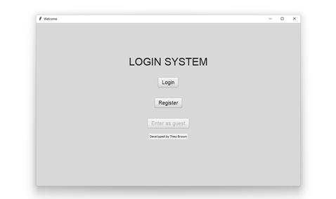
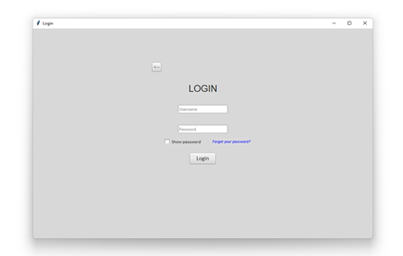
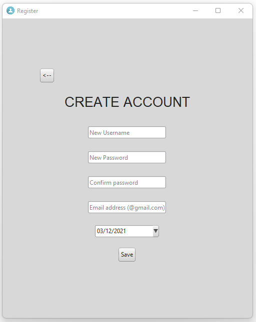

# Login-System-Tkinter
Secure login system made with python tkinter. To run the program run 'main.py'. If there is no database, it will be created automatically.

Requirements:
- Python 3

To install the other requirements run this on command line:
```
pip list --format=freeze > requirements.txt
```

Features:
- Login
- Registration
- Secure hashed passwords (blake2b algorithm)
- Plaaceholder entries
- Show/hide password
- Database storage
- Retrieve and reset forgotten passwords through gmail
- Aethetic tkinter gui

# How it works
When in main.py create an instance of the StartApp(), this will show the aplication itself:
```python
>>> app = StartApp()
```


After having logged in as a user or guest the window will close, you can then get the following attributes.

Having logged in:
```python
>>> print(app.logged_in)
True

>>> print(app)
'Logged in as user/guest'

>>> print(app.mode)
'guest/user'
```

Closing window without login nor entering as guest:
```python
>>> print(app.logged_in)
False

>>> print(app)
'Not logged in'

>>> print(app.mode)
None
```

## Login page
When you login you enter can enter a username and passsword which are verified in the database. You can hide and show the password.
You can also reset your password.



## Registration Page
Register a new user and it will be stored into the database file 'users.db'.



To browse the db file you can download this database browser: 
- [DB Browser](https://sqlitebrowser.org/)
