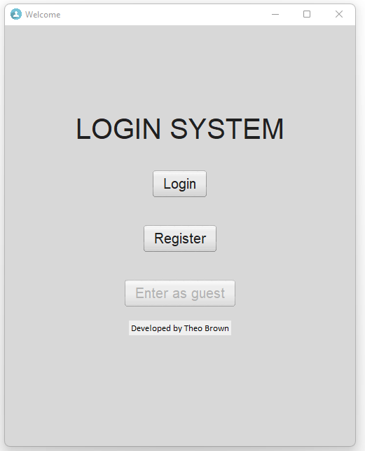
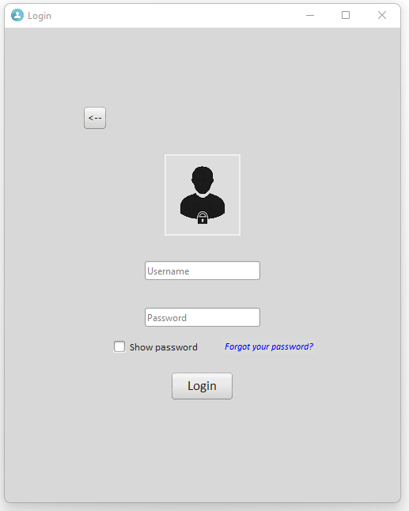

# Login-System-Tkinter
Secure login system made with python tkinter. To run the program run 'main.py'.

Requirements:
- Python 3

To install the other requirements run this on command line:
```
pip list --format=freeze > requirements.txt
```

Features:
- Login
- Registration
- Secure hashed passwords (blake2b algorithm)
- Plaaceholder entries
- Show/hide password
- Database storage
- Retrieve and reset forgotten passwords through gmail
- Aethetic tkinter gui

# How it works
This is the starting page where you can select whether to login or register.



## Login page
When you login you enter can enter a username and passsword which are verified in the database. You can hide and show the password.
You can also reset your password.



## Registration Page
Register a new user and it will be stored into the database file 'users.db'.


To browse the db file you can download this database browser: 
- [DB Browser](https://sqlitebrowser.org/)
